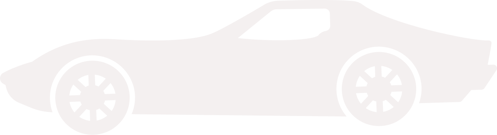

<!-- Repository Information & Links-->
<br />


<!-- HEADER SECTION -->
<h5 align="center" style="padding:0;margin:0;">Vian du Plessis</h5>
<h5 align="center" style="padding:0;margin:0;">21100483</h5>
<h6 align="center">DV200 - Term 1 | 2022</h6>
</br>
<p align="center">

  <a href="https://github.com/Vian-du-Plessis/carsclash">
    
  </a>
  
  <h3 align="center">Cars Clash</h3>

  <p align="center">
    This is a project I made for my Second Year of University at The Open Window. It is a react project using the Car Specs API to demonstrate Component Based Web Development and data visualization using charts.js
    
   <br />
   <br />
   <a href="path/to/demonstration/video">View Demo</a>
    ·
    <a href="https://github.com/Vian-du-Plessis/carsclash/issues">Report Bug</a>
    ·
    <a href="https://github.com/Vian-du-Plessis/carsclash/issues">Request Feature</a>
</p>
<!-- TABLE OF CONTENTS -->

## Table of Contents

* [About the Project](#about-the-project)
  * [Project Description](#project-description)
  * [Built With](#built-with)
* [Getting Started](#getting-started)
  * [Prerequisites](#prerequisites)
  * [How to install](#how-to-install)
* [Features and Functionality](#features-and-functionality)
* [Concept Process](#concept-process)
   * [Ideation](#ideation)
   * [Wireframes](#wireframes)
   * [My second apporach to the Web App](#my-second-apporach-to-the-web-app)
* [Development Process](#development-process)
   * [Implementation Process](#implementation-process)
        * [Highlights](#highlights)
        * [Challenges](#challenges)
        * [Above And Beyond](#above-and-beyond)
   * [Future Implementation](#future-implementation)
* [Final Outcome](#final-outcome)
    * [Mockups](#mockups)
    * [Video Demonstration](#video-demonstration)
* [License](#license)
* [Contact](#contact)
* [Acknowledgements](#acknowledgements)

<!--PROJECT DESCRIPTION-->
## About the Project
<!-- header image of project -->


### Project Description

For this project we had to develop a data driven web application using API's, React & Charts.js. We had the opportunity to choose a API of our own liking and use that API as the building block for our Web Application that resolves around the data that the API provides. We were required to utilise Charts.js, an open source data visualisation framework. In addition we also had to implement our own form of data visualisation that relates to the theme of the data set itself. We also explored the concept of component based web development and used it as our building block for this project.

### Built With

* [React](https://reactjs.org/)
* [Node.js](https://nodejs.org/en/)
* [Chart.js](https://www.chartjs.org/)
* [React Slick](https://react-slick.neostack.com/)

<!-- GETTING STARTED -->
<!-- Make sure to add appropriate information about what prerequesite technologies the user would need and also the steps to install your project on their own mashines -->
## Getting Started

The following instructions will get you a copy of the project up and running on your local machine for development and testing purposes.

### Prerequisites

Ensure that you have the latest version of [NPM](https://www.npmjs.com/) installed on your machine. The [GitHub Desktop](https://desktop.github.com/) program will also be required.

### How to install

### Installation
Here are a couple of ways to clone this repo:

1. GitHub Desktop </br>
Enter `https://github.com/Vian-du-Plessis/carsclash.git` into the URL field and press the `Clone` button.

2. Clone Repository </br>
Run the following in the command-line to clone the project:
   ```sh
   git clone https://github.com/Vian-du-Plessis/carsclash.git
   ```
    Open `Software` and select `File | Open...` from the menu. Select cloned directory and press `Open` button

3. Install Dependencies </br>
Run the following in the command-line to install all the required dependencies:
   ```sh
   npm install
   ```

4. An API key is not required


<!-- FEATURES AND FUNCTIONALITY-->
<!-- You can add the links to all of your imagery at the bottom of the file as references -->
## Features and Functionality

<!-- note how you can use your gitHub link. Just make a path to your assets folder -->


### The Best Model That Audi Has Produced

All the data that the API provides is neatly divided up into groups to contextualize it for the users looking at the data. At the top, there is a car selected when the page loads and the vehicle's specifications are also shown next to the picture of the car and the user can also change this car by clicking on the edit icon on the right side of the page, by clicking on this icon, a modal will popup and present a selection to the user where they can select another car to display on the dashboard. Next up, the user can see all the specifications that the API can give of a vehicle by clicking on the view more label at the bottom left of the page. This will trigger another modal to popup and show the user a list of all the specs. Last but not least, there is a short comparison section on the dashboard where the user can see the top speed of 6 randomly selected cars. The user can change these cars by clicking on the change icon just above the chart. I also implemented two sliders on the dashboard page.


### Compare your favourite audi models

On the compare page, the user can start by selecting the first vehicle they want to compare and working through each selection. First, they would need to choose the model they want to reach. Secondly, they would need to select the generation of the model they want to compare, and after selecting the age, they can choose the engine modification they want to reach. After selecting the first car, they should do the same thing for car two. After selecting the two vehicles they wish to compare on the right-hand side, a bar chart will show the two vehicles' Top Speed, Power and Torque differences. There are two more charts at the bottom of the page, but before the charts display some data, the user must select the Spec they want to see for both cars.


### See the history of models

And finally the last page, on the timeline page the user can select the model they want to see the history of. After selecting the model the user can then select the datatype they want to see on the timeline. If they for example select the model A1 and the datatype Power they will see how the power output of the A1 changed from the first time it was released to the latest model.


<!-- CONCEPT PROCESS -->
<!-- Briefly explain your concept ideation process -->
<!-- here you will add things like wireframing, data structure planning, anything that shows your process. You need to include images-->
## Concept Process

The `Conceptual Process` is the set of actions, activities and research that was done when starting this project.

### Ideation

My first idea was to make a dashboard that looks kind of "cartoony" but not so much that it does not look like a usable Web App. I wanted to use some SVG's for images on the dashboard to contextualize the data that the API(This API is not the same as the one I used for my final choice, more on this later) returns. So I wanted the dashboard to kind of have this layout but just not as 'formal' or sophisticated. This is the ideas that I had in mind(not mine).


<br>


### Wireframes

This is the first wireframes that I drew up and it was my plan to use these until I had to change my whole approach to how I am gonna contextualize the information and what my web app is gonna be capable of. They are listed in the following order:
1. Dashboard
2. Compare 
3. Timeline


### My second apporach to the Web App

So just for clarification. At first when I researched what API I wanted to use I had my mind set on a API that return Car Specifications of different cars. After looking for a few days to get the API that would my needs perfectly I finally found one. I based all my designs of this designs and I also planned all of my functionality around the data that the API provides. All went well for the first 2 weeks of building the Web App. At the start of week 3 when I got up the one morning and wanted to start working on the project again I realized that the API is not support anymore and they stopped its service. At this moment I quickly started looking for a similar API that provides data about cars and their specifications, but I found nothing. This is when I decided to make the daring decision of building my own API for my project and just using that, and at first I thought I was set to fail, but to my surprise after a few days of tutorials and experimenting I finnaly got it up and running. After building my own API I started working on new designs(also now my final designs) and I also tried making it look more professional. The new designs will be at bottom of the ReadME under mockups.


<!-- DEVELOPMENT PROCESS -->
## Development Process

The `Development Process` is the technical implementations and functionality done in the frontend and backend of the application.

### Implementation Process
<!-- stipulate all of the functionality you included in the project -->
<!-- This is your time to shine, explain the technical nuances of your project, how did you achieve the final outcome!-->

* Implemented Routing with `React-Router v6`.
* Utilized React `Charts.JS` dependency for Data visualization.
* Utilized `React-Slick` library for implementing Sliders on the Dashboard.
* The API endpoint is not available yet because I don't want to make it public since there is still a lot of work to do. But here is a picture of what it looks like on RapidAPI:


#### Highlights
<!-- stipulated the highlight you experienced with the project -->
* To start of, the thing that I enjoyed most about the project was the use of Reusable Components. The main thing that I learned and that stands out the most for me is how you can create a very complex component but you can use it as a very simple component or you can use it in the most complex from that you made it, and that is what made this project memorable to me, I always thought elements were so limited but I was completely wrong. I also learned how to create popup modals and how to hide them on button clicks.
More about what I learned in the Above and Beyond section
* Another thing that I really enjoyed, although not apart of the project requirements was building the API and seeing how it all comes togethers after days of not getting any results.

#### Challenges
<!-- stipulated the challenges you faced with the project and why you think you faced it or how you think you'll solve it (if not solved) -->
* The main thing that I struggled with was when I had to take the designs from Figma and put them into actual HTML, I did not know where to start. I think the reason for this is because I don't really like doing the design aspect of Development. But lately I have been starting to like the part where you must make the Web App look nice.
* Another thing that I struggled with was when I had to pass a useRef to certain components and it did not want to work. I will explain how I fixed this in the Above and Beyond Section.


#### Above And Beyond

What aspects of this final build contribute to the `Above And Beyond` Component of your brief?
<!-- what did you learn outside of the classroom and implement into your project-->
* API Build.
* During the project I learned how to build my own API. While building the API I learned how Query and Parameters works when you are sending a request to the database (In my case a json file with all the data as I hosted it on heroku). I also had to carefully structure the queries as I needed to keep in mind that the developer using the API may only pass one query to search for and that I should be able to have the logic implemented to know what to do when the user send multiple queries or just one.
* Popup Modals.
* On my Dashboard Page I have two buttons that needs to open up modals when the user clicks on them. The one Modal shows just a list of specs and the other modal has a select that the user can change to view other cars on the dashboard. How I implemented this is by using a useState() with the name isModalOpen, and by setting the defualt value as false meaning the modal is closed and when the user clicked a certain button the state is set to true and the modal shows. I did the same with the button that should close the modal but just setting the state to false again.


### Future Implementation
<!-- stipulate functionality and improvements that can be implemented in the future. -->

* The main thing that I would like to accomplish in the future is to have my API fully working as a service while also using this Web App as an example of what you can do with the API.
* The second thing that I would like to implement is the use of 3D Models and have them in a Modal where the user can click a button to see them.

<!-- MOCKUPS -->
## Final Outcome

### Mockups


<br>

<br>


<!-- VIDEO DEMONSTRATION -->
### Video Demonstration

To see a run through of the application, click below:

[View Demonstration](path/to/video/demonstration)


See the [open issues](https://github.com/Vian-du-Plessis/carsclash/issues) for a list of proposed features (and known issues).

<!-- AUTHORS -->
## Authors

* [Vian du Plessis](https://github.com/Vian-du-Plessis)

<!-- LICENSE -->
## License

Distributed under the MIT License. See `LICENSE` for more information.\

<!-- LICENSE -->
## Contact

* Vian du Plessis - [viandupie@gmail.com](mailto:email@address)
* **Project Link** - https://github.com/Vian-du-Plessis/carsclash

<!-- ACKNOWLEDGEMENTS -->
## Acknowledgements
<!-- all resources that you used and Acknowledgements here -->
* [Stackoverflow](https://stackoverflow.com/)
* [W3Schools](https://www.w3schools.com/)
* [MDN Web Docs](https://developer.mozilla.org/en-US/)
* [React](https://reactjs.org/)


